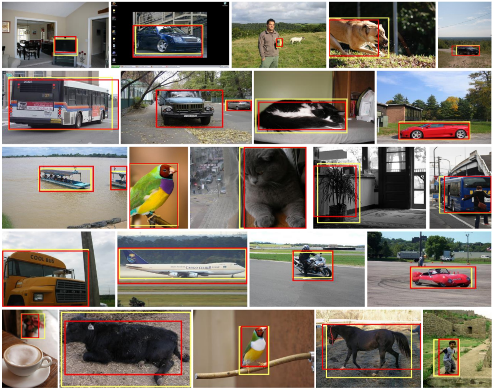

# C-MIL
code for C-MIL: Continuation Multiple Instance Learning for Weakly  Supervised Object Detection

## Environments

* Ubuntu 16.04 LTS
* NVIDIA V100 + CUDA9.0 + CuDNN7.0
* [Torch7](http://torch.ch/docs/getting-started.html)

## Detection Samples


## Train and Test

1. Install the dependencies
    ```bash
    cd ./C-MIL
    export DIR=$(pwd) 
    
    luarocks install hdf5 matio protobuf rapidjson loadcaffe xml
    
    cd $DIR/libs/functions
    sh install.sh
    
    cd $DIR/layers
    luarocks make
    ```

2. Download dataset, proposals and ImageNet pre-trained model

    Download VOC2007 from:
    http://host.robots.ox.ac.uk/pascal/VOC/voc2007/VOCtrainval_06-Nov-2007.tar
    http://host.robots.ox.ac.uk/pascal/VOC/voc2007/VOCtest_06-Nov-2007.tar
    
    Download proposals from: 
    [https://dl.dropboxusercontent.com/s/orrt7o6bp6ae0tc/selective_search_data.tgz](https://github.com/rbgirshick/fast-rcnn)
    
    Download VGGF from:
    http://www.robots.ox.ac.uk/~vgg/software/deep_eval/releases/bvlc/VGG_CNN_F.caffemodel
    https://gist.githubusercontent.com/ksimonyan/a32c9063ec8e1118221a/raw/6a3b8af023bae65669a4ceccd7331a5e7767aa4e/VGG_CNN_F_deploy.prototxt
    ```bash
    mkdir $DIR/data    
    mkdir $DIR/output
     ``` 
    The data folder has the following structure:
    ```bash
    $C-MIL/data/datasets/VOCdevkit_2007/
    $C-MIL/data/datasets/VOCdevkit_2007/VOCcode
    $C-MIL/data/datasets/VOCdevkit_2007/VOC2007
    $C-MIL/data/datasets/VOCdevkit_2007/...
    $C-MIL/data/datasets/proposals/
    $C-MIL/data/models/
    $C-MIL/data/results/
    ``` 
    
3. Train, test and evaluate
 
    ```bash
    cd $DIR
    # train
    th train_cmil.lua 0 SSW
    # test
    th test_cmil.lua 0 SSW
    # evaluate
    th detection_mAP.lua 0 SSW output/path/to/scorefiles/score_test_epoch20.h5 2
    ```
    
## Acknowledgements

Acknowledgements will be added later.

